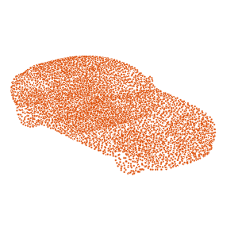

# Pixel2Mesh
This repository contains the TensorFlow implementation for the following paper</br>

[Pixel2Mesh: Generating 3D Mesh Models from Single RGB Images (ECCV2018)](https://arxiv.org/abs/1804.01654)</br>

Nanyang Wang*, [Yinda Zhang](http://robots.princeton.edu/people/yindaz/)\*, [Zhuwen Li](http://www.lizhuwen.com/)\*, [Yanwei Fu](http://yanweifu.github.io/), [Wei Liu](http://www.ee.columbia.edu/~wliu/), [Yu-Gang Jiang](http://www.yugangjiang.info/).

The code is based on the [gcn](https://github.com/tkipf/gcn) framework.

#### Citation
If you use this code for your research, please consider citing:

    @inProceedings{wang2018pixel2mesh,
      title={Pixel2Mesh: Generating 3D Mesh Models from Single RGB Images},
      author={Nanyang Wang and Yinda Zhang and Zhuwen Li and Yanwei Fu and Wei Liu and Yu-Gang Jiang},
      booktitle={ECCV},
      year={2018}
    }

# Project Page
The project page is available at http://bigvid.fudan.edu.cn/pixel2mesh

# Dependencies
Requirements:
* Python2.7+ with Numpy and opencv-python
* [Tensorflow (version 1.0+)](https://www.tensorflow.org/install/)
* [TFLearn](http://tflearn.org/installation/)

Our code has been tested with Python 2.7, **TensorFlow 1.3.0**, TFLearn 0.3.2, CUDA 8.0 on Ubuntu 14.04.

# Installation
    git clone https://github.com/nywang16/Pixel2Mesh.git
    cd Pixel2Mesh
    python setup.py install    

# Running the demo
First, you need download pre-trained models.
* version 1: http://bigvid.fudan.edu.cn/pixel2mesh/eccv2018/checkpoint.zip
* version 2: **We will release an improved model in a few days !!**
```
cd pixel2mesh/utils
wget http://bigvid.fudan.edu.cn/pixel2mesh/eccv2018/checkpoint.zip
unzip checkpoint.zip
```

#### Reconstructing shapes
    python demo.py --image utils/examples/plane.png
Run the demo code and the output mesh file is saved in utils/examples/plane.obj 

If you have any problem when importing `cd_dist.so`, you could try to compile it yourself, please refer to [Fan et. al.](https://github.com/fanhqme/PointSetGeneration)

#### Input image, output mesh


# Dataset

We used the [ShapeNet](https://www.shapenet.org) dataset for 3D models, and rendered views from [3D-R2N2](https://github.com/chrischoy/3D-R2N2):</br>
When using the provided data make sure to respect the shapenet [license](https://shapenet.org/terms).

Below is the complete set of training data. Download it into the utils/ folder.
https://drive.google.com/file/d/1Z8gt4HdPujBNFABYrthhau9VZW10WWYe/view?usp=sharing </br>

    cd pixel2mesh/utils
    tar -xzf ShapeNetTrain.tar


The training/testing split can be found in `utils/train_list.txt` and `utils/test_list.txt` </br>
    
The file is named in syntheticID_modelID_renderID.dat format, and the data processing script will be released soon.

Each .dat file in the provided data contain: </br>
* The rendered image from 3D-R2N2. We resized it to 224x224 and made the background white.
* The sampled point cloud (with vertex normal) from ShapeNet. We transformed it to corresponding coordinates in camera coordinate based on camera parameters from the Rendering Dataset.

**Input image, ground truth point cloud.**</br>



# Training
    python train.py
You can change the training data, learning rate and other parameters by editing `train.py`

# Statement
This software is for research purpose only. </br>
Please contact us for the licence of commercial purposes. All rights are preserved.

# Contact
Nanyang Wang (nywang16 AT 163.com)

Yinda Zhang (yindaz AT cs.princeton.edu)

Zhuwen Li (lzhuwen AT gmail.com)

Yanwei Fu (yanweifu AT fudan.edu.cn)

Yu-Gang Jiang (ygj AT fudan.edu.cn)

Any comments or suggestions are welcome !
